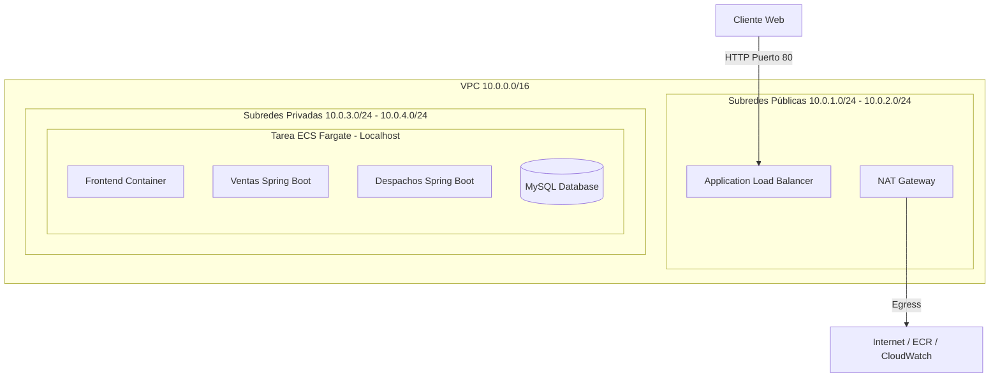

# Sistema de Gestión de Ventas y Despachos (Orquestación en AWS ECS Fargate)

Este repositorio contiene la arquitectura de microservicios y la configuración de automatización para la solución cloud de la empresa **Innovatech Chile**, desplegada de forma elástica y con alta disponibilidad en **AWS ECS (Elastic Container Service) Fargate** bajo una topología de red segura en la región **`us-east-1`** (N. Virginia). 

El proyecto integra:
1. **Frontend**: React + Vite (Nginx).
2. **Backend Ventas**: Microservicio en Spring Boot.
3. **Backend Despachos**: Microservicio en Spring Boot.
4. **Base de Datos**: MySQL 8.0.

---

## Arquitectura Cloud (AWS)

La infraestructura fue desplegada en AWS utilizando las mejores prácticas de disponibilidad y seguridad corporativa, siendo 100% compatible con las políticas de **AWS Academy Learned Labs** (ejecutándose bajo el rol `LabRole`).



### Componentes de Red e Infraestructura en AWS
* **VPC & Subredes (4 Subredes)**:
  * **2 Subredes Públicas**: Alojan el **Application Load Balancer (ALB)** público para la entrada de tráfico de usuarios.
  * **2 Subredes Privadas**: Alojan la tarea de **ECS Fargate**, aislando la base de datos y los microservicios del acceso público directo desde internet por seguridad.
* **NAT Gateway**: Asociado a las subredes públicas, provee traducción de direcciones y salida segura a internet para que las tareas en subredes privadas puedan comunicarse con ECR y CloudWatch Logs.
* **Arquitectura Multi-Contenedor (Task Definition)**:
  * Debido a las políticas de seguridad de AWS Academy que impiden configurar Zonas DNS privadas (`CreatePrivateDnsNamespace`), se optó por consolidar los 4 contenedores (MySQL, Ventas, Despachos y Frontend) dentro de una única definición de tarea de ECS.
  * Al compartir la misma interfaz de red (`awsvpc`), los servicios se comunican de forma extremadamente rápida y segura mediante la interfaz local **`127.0.0.1` (localhost)** en sus puertos correspondientes (`80`, `8080`, `8081` y `3306`).
  * **Health Check**: El contenedor de MySQL tiene configurado un monitoreo interno (`mysqladmin ping`). Los microservicios de Spring Boot están configurados para esperar que la base de datos esté lista (`HEALTHY`) antes de inicializar sus procesos.

---

##  Estructura del Proyecto

* `/front_despacho`: Código fuente del frontend (Vite + React) y su archivo `Dockerfile`.
* `/back-Ventas_SpringBoot`: Microservicio de gestión de ventas y su `Dockerfile`.
* `/back-Despachos_SpringBoot`: Microservicio de gestión de despachos y su `Dockerfile`.
* `.github/workflows/deploy.yml`: Pipeline de CI/CD automatizado para el despliegue en ECS.
* `.github/workflows/task-definition.json`: Definición de la tarea y dependencias de Fargate.

---

##  Pipeline de CI/CD (GitHub Actions)

El flujo de integración y entrega continua (CI/CD) automatiza la publicación de la aplicación ante cualquier cambio:
1. **Trigger**: Se activa con cualquier push en la rama `main`.
2. **Build**: Compila el código Java (Spring Boot) y genera el build de producción del Frontend en React.
3. **Registro (Amazon ECR)**: Sube las imágenes resultantes a los repositorios de contenedores en ECR.
4. **Despliegue (Amazon ECS)**: Actualiza la Task Definition y realiza un despliegue progresivo (Rolling Update) en el servicio Fargate, reemplazando la versión anterior sin pérdida de servicio.

---

##  Ejecución Local (Docker Compose)

Para levantar y probar toda la arquitectura de forma local en tu máquina de desarrollo, ejecuta en la raíz del proyecto:

```bash
docker compose up --build -d
```

### Puertos Locales:
* **Frontend**: [http://localhost](http://localhost)
* **Backend Ventas**: [http://localhost:8080/api/v1/ventas](http://localhost:8080/api/v1/ventas)
* **Backend Despachos**: [http://localhost:8081/api/v1/despachos](http://localhost:8081/api/v1/despachos)
* **Base de Datos (MySQL)**: `localhost:3306`

---

##  Operación en Producción (AWS)

### Enlaces de Acceso
* **URL de Acceso Web (ALB)**: [http://semestral-alb-1495860592.us-east-1.elb.amazonaws.com](http://semestral-alb-1495860592.us-east-1.elb.amazonaws.com)
* **API Ventas**: Redirige al puerto `8080` de la tarea de Fargate a través de `/api/ventas`.
* **API Despachos**: Redirige al puerto `8081` de la tarea de Fargate a través de `/api/despachos`.

### Ejemplos de Pruebas de APIs

#### 1. Crear una Venta (POST):
```bash
curl -X POST http://semestral-alb-1495860592.us-east-1.elb.amazonaws.com/api/ventas \
  -H "Content-Type: application/json" \
  -d '{
    "direccionCompra": "Av. Apoquindo 4500, Las Condes",
    "valorCompra": 45990,
    "fechaCompra": "2026-06-24",
    "despachoGenerado": false
  }'
```

#### 2. Consultar Ventas (GET):
```bash
curl http://semestral-alb-1495860592.us-east-1.elb.amazonaws.com/api/ventas
```

#### 3. Crear un Despacho (POST):
```bash
curl -X POST http://semestral-alb-1495860592.us-east-1.elb.amazonaws.com/api/despachos \
  -H "Content-Type: application/json" \
  -d '{
    "fechaDespacho": "2026-06-25",
    "patenteCamion": "AB-CD-12",
    "intento": 1,
    "idCompra": 1,
    "direccionCompra": "Av. Apoquindo 4500, Las Condes",
    "valorCompra": 45990,
    "despachado": false
  }'
```
