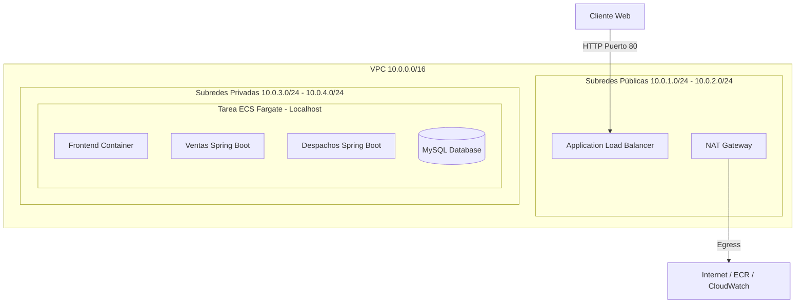

# Sistema de Gestión de Ventas y Despachos (Orquestación en AWS ECS Fargate)

Este repositorio contiene la arquitectura de microservicios e infraestructura como código (IaC) para la solución cloud de la empresa **Innovatech Chile**, desplegada de forma elástica y de alta disponibilidad en **AWS ECS (Elastic Container Service) Fargate** bajo una topología de red segura.

El proyecto integra:
1. **Frontend**: React + Vite (Nginx).
2. **Backend Ventas**: Microservicio en Spring Boot.
3. **Backend Despachos**: Microservicio en Spring Boot.
4. **Base de Datos**: MySQL 8.0.

---

## ☁️ Arquitectura Cloud (AWS)

La infraestructura fue aprovisionada utilizando **Terraform** en la región **`us-east-1`** (N. Virginia), cumpliendo con las pautas de seguridad corporativa y adaptada para ser compatible con cuentas restringidas como **AWS Academy Learned Labs** (usando `LabRole`).



### Componentes de Red e Infraestructura
* **VPC & Subredes (4 Subredes)**:
  * **2 Subredes Públicas**: Alojan el **Application Load Balancer (ALB)** público.
  * **2 Subredes Privadas**: Alojan el servicio de **ECS Fargate**, aislando los microservicios y la base de datos del acceso directo desde internet.
* **NAT Gateway & Egress**: Un NAT Gateway con IP Elástica en la subred pública da acceso seguro a internet a las tareas de Fargate en la subred privada (necesario para descargar imágenes de ECR y emitir logs a CloudWatch).
* **Arquitectura Multi-Contenedor (Task Definition)**:
  * Para evitar la restricción de AWS Academy sobre la creación de zonas DNS privadas (`CreatePrivateDnsNamespace`), se diseñó una arquitectura multi-contenedor dentro de una sola Task Definition compartiendo la interfaz de red `awsvpc`.
  * Los contenedores se comunican de manera segura e interna mediante **`127.0.0.1` (localhost)** en sus respectivos puertos (`80`, `8080`, `8081` y `3306`).
  * **Health Check & Dependencias**: Se configuró un health check nativo en el contenedor de MySQL (`mysqladmin ping`) de tal forma que los microservicios de Spring Boot no se inicializan hasta que la base de datos se reporte 100% saludable.

---

## 🛠️ Estructura del Proyecto

* `/terraform`: Archivos de configuración de Terraform.
  * `main.tf`: Configuración del proveedor de AWS.
  * `vpc.tf`: Definición de la red (VPC, subredes públicas/privadas, Internet Gateway, NAT Gateway).
  * `security_groups.tf`: Políticas cortafuegos (ALB e interfaces ECS).
  * `alb.tf`: Application Load Balancer y enrutamiento HTTP.
  * `ecr.tf`: Repositorios de registros de contenedores ECR.
  * `ecs.tf`: Clúster de ECS, tareas multi-contenedor Fargate y servicios.
  * `autoscaling.tf`: Configuración del autoescalado elástico del clúster.
* `/front_despacho`: Código fuente del frontend (Vite + React) y su archivo `Dockerfile`.
* `/back-Ventas_SpringBoot`: Microservicio de gestión de ventas y su `Dockerfile`.
* `/back-Despachos_SpringBoot`: Microservicio de gestión de despachos y su `Dockerfile`.
* `.github/workflows/deploy.yml`: Pipeline de CI/CD automatizado.

---

## 🚀 Pipeline de CI/CD (GitHub Actions)

El workflow de CI/CD automatiza todo el proceso de entrega continua:
1. **Trigger**: Se activa con cualquier push en la rama `main`.
2. **Build**:
   * Compila los proyectos Spring Boot y el frontend React.
   * Genera las imágenes Docker de producción.
3. **Registry**:
   * Inicia sesión en **Amazon ECR**.
   * Sube las imágenes construidas etiquetadas con la versión y con `latest`.
4. **Deploy**:
   * Descarga la definición de la tarea actual de ECS.
   * Reemplaza las rutas de imágenes con las nuevas construidas.
   * Despliega la nueva versión en el clúster de ECS Fargate aplicando una estrategia de actualización progresiva (Rolling Update) sin tiempo de inactividad.

---

## 💻 Ejecución Local (Docker Compose)

Para levantar y probar toda la arquitectura localmente en tu máquina mediante contenedores Docker, ejecuta en la raíz del proyecto:

```bash
docker compose up --build -d
```

### Puertos Locales:
* **Frontend**: [http://localhost](http://localhost)
* **Backend Ventas**: [http://localhost:8080/api/v1/ventas](http://localhost:8080/api/v1/ventas)
* **Backend Despachos**: [http://localhost:8081/api/v1/despachos](http://localhost:8081/api/v1/despachos)
* **Base de Datos (MySQL)**: `localhost:3306`

---

## 🔗 Endpoints Principales y Operación (Producción)

### Enlaces de Infraestructura
* **URL de Acceso Web (ALB)**: [http://semestral-alb-1678082745.us-east-1.elb.amazonaws.com](http://semestral-alb-1678082745.us-east-1.elb.amazonaws.com)
* **Endpoint API Ventas**: `/api/ventas` -> Redirige internamente a `localhost:8080/api/v1/ventas` en Fargate.
* **Endpoint API Despachos**: `/api/despachos` -> Redirige internamente a `localhost:8081/api/v1/despachos` en Fargate.

### Ejemplos de Peticiones API (Operación)

#### 1. Crear una nueva Venta (POST `/api/ventas`):
```bash
curl -X POST http://semestral-alb-1678082745.us-east-1.elb.amazonaws.com/api/ventas \
  -H "Content-Type: application/json" \
  -d '{
    "direccionCompra": "Av. Providencia 1100, Santiago",
    "valorCompra": 25000,
    "fechaCompra": "2026-06-24",
    "despachoGenerado": false
  }'
```

#### 2. Consultar Ventas Existentes (GET `/api/ventas`):
```bash
curl http://semestral-alb-1678082745.us-east-1.elb.amazonaws.com/api/ventas
```

#### 3. Crear un nuevo Despacho (POST `/api/despachos`):
```bash
curl -X POST http://semestral-alb-1678082745.us-east-1.elb.amazonaws.com/api/despachos \
  -H "Content-Type: application/json" \
  -d '{
    "fechaDespacho": "2026-06-25",
    "patenteCamion": "AB-CD-12",
    "intento": 1,
    "idCompra": 1,
    "direccionCompra": "Av. Providencia 1100, Santiago",
    "valorCompra": 25000,
    "despachado": false
  }'
```
